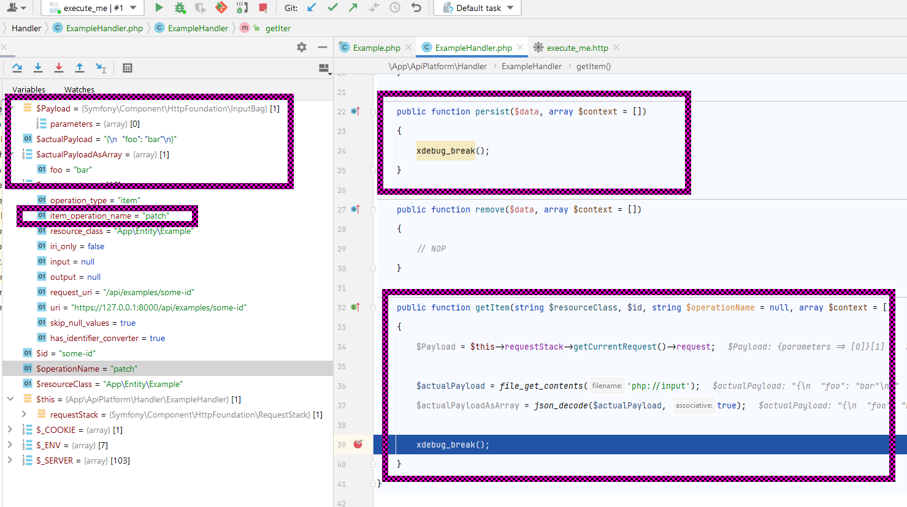

# README

### Steps to reproduce:
1. `$ composer install`
2. `$ symfony serve`
3. execute `execute_me.http` w/ xdebug
   - (optional) change domain/port

### Result
PATCH-request will be handled by `\App\ApiPlatform\Handler\ExampleHandler::getItem` (incorrect) instead of 
`\App\ApiPlatform\Handler\ExampleHandler::persist` (correct).

### Why is this a bug?
> "To mutate the application states during POST, PUT, **PATCH** or DELETE operations, API Platform uses classes called data persisters."
([https://api-platform.com/docs/core/data-persisters/#data-persisters](https://api-platform.com/docs/core/data-persisters/#data-persisters))

### Screenshot
> 

### Creation of this repo:
1. `$ symfony new demo`
2. `$ symfony composer req api`
3. `$ symfony serve`
4. additional files:
   - `README.md`
   - `execute_me.http`
   - `src/ApiPlatform/Handler/ExampleHandler.php`
   - `Entity/Example.php`
